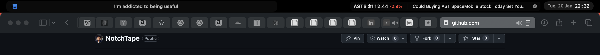

<div align="center">
  <h1>NotchTape</h1>
  <p>A macOS menu bar app that turns the space around your notch into a passive information feed.</p>
</div>

## What it does

NotchTape displays scrolling information in your menu bar — HackerNews headlines on the left, stock movements on the right. Passive information absorption without context switching.



## Installation

> Requirements: macOS 14.5 or later

1. Download [`NotchTape.zip`](https://github.com/s23h/NotchTape/releases/latest) from Releases
2. Unzip and drag `NotchTape.app` to your **Applications** folder
3. Launch **NotchTape** from Applications or Spotlight

### Can't open the app?

Right-click `NotchTape.app` → Click `Open` → Click `Open` again.

(Apple requires $119/year to remove the unsigned app warning.)

## Configuration

Right-click the menu bar icon (✦) → **Settings** to customize:

- **Market Indices** — Add/remove indices like `^GSPC` (S&P 500), `^DJI` (Dow Jones), `^IXIC` (NASDAQ), `^VIX`
- **Stock Tickers** — Add/remove individual stocks like `AAPL`, `TSLA`, `NVDA`

The display rotates through your indices and stocks in pages of 4. Click any ticker to see related news.

## Development

Built with Swift and [Tuist](https://tuist.io/).

```shell
# Clone
git clone https://github.com/s23h/NotchTape.git
cd NotchTape/src/

# Install tuist (if needed)
brew tap tuist/tuist && brew install --formula tuist

# Install dependencies & build
tuist install && tuist build

# Open in Xcode
tuist generate
```

## Credits

Fork of [navtoj/NotchBar](https://github.com/navtoj/NotchBar) by [@navtoj](https://github.com/navtoj) — customized for HackerNews + stock tracking.

## License

[AGPL-3.0](LICENSE) — same as the original project.
